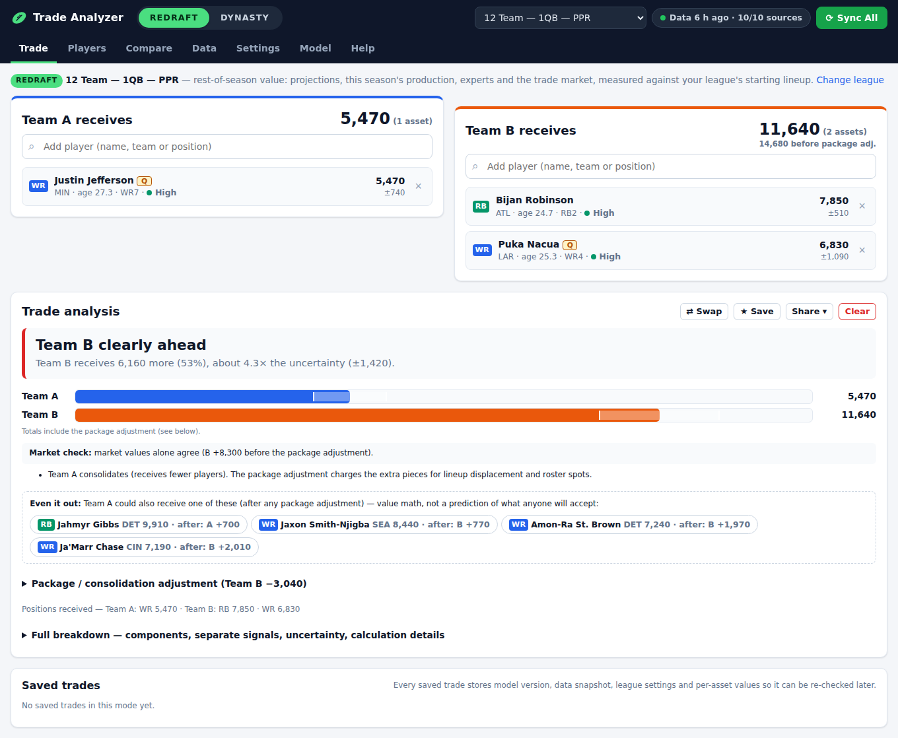

# Fantasy Football Trade Analyzer

A locally run **redraft + dynasty** trade analyzer that builds its own transparent valuation from many independent free
sources (projections, expert consensus, trade markets, ADP, statistics, injuries, schedule) instead of copying one
website's trade values — tuned to **your** league's scoring, roster and size.

* One-button **Sync All** with a sync dashboard, per-source status, retries, stale-data warnings and automatic failover
* Works offline from the last good dataset; one broken source never breaks the app
* Manual CSV/JSON import as a first-class path (KeepTradeCut, FantasyPros exports, any projections/rankings/ADP/values)
* Canonical player identity resolution across 15+ ID systems; ambiguous players are never silently merged
* Every value explains itself: **"Why this value?"**, **"Why did this value change?"**, uncertainty ranges, confidence
* Dynasty: calibrated aging curves, attrition and draft-capital priors, multi-year projections, rookie pick model with
  future and unknown-slot picks
* Zero npm dependencies. Node 18+ only.



More screenshots: [dynasty trade with picks](docs/img/trade-dynasty.png) · ["Why this value?"](docs/img/modal-why.png) · [sync dashboard](docs/img/data.png) · [mobile](docs/img/mobile-trade.png)

## Download & run (no coding needed)

1. **Download** the version for your computer (one click):

   | Your computer | Download |
   |---|---|
   | 🪟 **Windows** | [**TradeAnalyzer-Windows.zip**](https://github.com/smbrynien/Fantasy-Football-Trade-Analyzer/releases/latest/download/TradeAnalyzer-Windows.zip) |
   | 🍎 **Mac** (Apple Silicon or Intel) | [**TradeAnalyzer-Mac.zip**](https://github.com/smbrynien/Fantasy-Football-Trade-Analyzer/releases/latest/download/TradeAnalyzer-Mac.zip) |
   | 🐧 **Linux** | [**TradeAnalyzer-Linux.zip**](https://github.com/smbrynien/Fantasy-Football-Trade-Analyzer/releases/latest/download/TradeAnalyzer-Linux.zip) |

2. **Unzip** it (Windows: right-click → *Extract All…*; Mac: double-click the ZIP) and open the folder.
3. **Double-click "Start Trade Analyzer"** (the Windows `.bat`, Mac `.command` or Linux `.sh` file).
   The app opens in your web browser and downloads the latest football data by itself (~30 seconds the first time).
4. **Keep the small black/Terminal window open** while you use the app. Close it to quit.

Nothing to install — each download already contains everything it needs.
First time only, your computer may warn about a file from the internet:
* **Windows** "Windows protected your PC" → *More info* → *Run anyway*.
* **Mac** "cannot be opened / could not verify" → *System Settings → Privacy & Security* → *Open Anyway* (older macOS:
  right-click the file → *Open*).

Step-by-step help with troubleshooting: [HOW TO START.txt](HOW%20TO%20START.txt) (also inside the download).
The in-app **Help** tab answers common questions.

> Also works from GitHub's green **Code → Download ZIP** button: the Start file then downloads its engine (Node.js,
> ~30–45 MB) automatically the first time.

## Quick start (developers)

```bash
git clone https://github.com/smbrynien/Fantasy-Football-Trade-Analyzer && cd Fantasy-Football-Trade-Analyzer
npm start                     # → http://localhost:5177 (Node 18+; no npm install needed)
```

On first launch the data downloads automatically (`--no-auto-sync` / `FFTA_NO_AUTOSYNC=1` to disable;
`FFTA_AUTO_REFRESH_HOURS` controls refresh-on-launch, default 12). `npm start -- --open` also opens the browser.

Other commands:

| Command | What it does |
|---|---|
| `npm start` | Start the local server + app (port `PORT`, default 5177; next free port if busy) |
| `npm run sync` | Sync all sources from the terminal (prints a status table) |
| `npm run sync -- --force` | Re-download everything |
| `npm run sync -- --failed` | Retry only failed/partial sources |
| `npm run sync -- --source fantasycalc,espn` | Sync specific sources |
| `npm run rebuild` | Rebuild dataset/values from cached data (no network) |
| `npm run calibrate` | Re-derive aging curves, attrition, draft priors, rookie slot curve from historical data |
| `npm run backtest` | Evaluate consensus rankings vs actual production → `reports/backtest.json` |
| `npm run audit-model` | Full model audit: walk-forward backtests, correlations, ablations, stability, monotonicity, before/after → `reports/audit/` ([MODEL_AUDIT](docs/MODEL_AUDIT.md)). Before/after for a model change: `-- --freeze --snapshot-before --out=DIR` on the old model, `-- --only=compare --out=DIR` on the new one |
| `npm run package` | Build the ready-to-run ZIPs into `dist/` (what the release workflow publishes) |
| `npm test` | Run the automated test suite (offline) |
| `npm run lint` | Lint with ESLint (dev-only: uses a global ESLint 10 or fetches it via `npx`; nothing is added to the project) |
| `npm run test:e2e` | Optional browser smoke test on synthetic data (needs Playwright installed globally; skips otherwise) |

Optional settings: copy `.env.example` to `.env` (port, bind address, user agent, timeouts). No default source needs
an API key. Keep `HOST=127.0.0.1` unless you deliberately want to open it to your phone on the LAN (`HOST=0.0.0.0`).

**Releases:** every push to `main` runs `.github/workflows/release.yml` — lint, tests, builds the three ZIPs (app + bundled
Node.js `.node-version`) and publishes them as the latest GitHub Release, so the download links above always point at
the newest version.

## Using it

* **REDRAFT / DYNASTY** toggle (top) switches the valuation engine, columns, settings and tools.
* **League profile** dropdown: presets (10/12/14-team, 1QB/Superflex, PPR/half, dynasty) or your own. Edit anything in
  **Settings** (a preset is copied to a custom profile automatically), import/export profiles as JSON, or **Import from
  Sleeper league** (league ID → scoring + roster).
* **Trade**: search players by name/team/position ("jef", "det rb", "wr min"); in dynasty add picks ("2027 1st",
  "1.04") or use the pick adder (known slot, early/mid/late, unknown, custom range). The analysis shows totals,
  difference and %, uncertainty, component drivers, market vs model signals, the package (consolidation) math,
  win-now vs future and age. Save trades for later re-checking; export CSV/JSON; print.
* **Players**: searchable, filterable (position, team, age, value, injured, rookies), sortable, custom columns, CSV
  exports (all/redraft/dynasty).
* **Compare**: up to 8 players/picks side by side, dynasty age-curve overlay.
* **Rookies & Picks** (dynasty): rookie *prospect* values vs rookie *pick* values (separate tabs), pick grid by
  season/round/slot, methodology.
* **Data**: sync dashboard, source health (click a source for URLs, schema, frequency, fallback), manual import,
  data quality (validation, identity resolution UI, player events), snapshots.
* **Model**: methodology, your league's replacement levels, calibration charts, backtest results.

### Sync

1. Click **Sync All** (sources fetched in the last 30 min are skipped; **Force full refresh** re-downloads).
2. Each enabled adapter runs independently (3 in parallel). Raw responses are cached (gzipped).
3. Each batch is validated (schema drift, duplicates, invalid teams/positions/ages, duplicated ranks, record-count
   drops, mass value changes). Failing batches are **quarantined** and the previous good data is kept.
4. Authoritative player sources update the canonical player DB; every other record is resolved to a player.
5. The merged dataset is built (with failover for statistics/schedule/injuries), snapshotted, and value history is
   recorded. The UI reloads and shows exactly what succeeded, failed or is stale.

### Manual import

**Data → Manual Import** → choose a template → follow the source-specific steps → choose file → confirm column
mapping → review preview, validation, unmatched/ambiguous players and overwrite impact → **Import**.
Details: [docs/DATA_IMPORT.md](docs/DATA_IMPORT.md).

## Sources (verified 2026-10-02)

| Source | Automated | Used for |
|---|:-:|---|
| Sleeper API | ✅ | players, IDs, depth chart, reported injuries, season/week |
| Sleeper projections & stats (undocumented) | ✅ | Rotowire projections, ADP; weekly stats fallback, red-zone & snaps |
| FantasyCalc | ✅ | trade-derived market values & pick values, 30-day trends |
| DynastyProcess | ✅ | ID crosswalk, FantasyPros ECR mirror, DP values & picks |
| nflverse | ✅ | stats, target share/WOPR, snaps, official injury reports, schedule, player bio/draft |
| Fantasy Football Calculator | ✅ | redraft ADP |
| ESPN (undocumented) | ✅ | independent projections, ADP, injury status |
| KeepTradeCut | ❌ manual only | its Terms prohibit automated collection |
| FantasyPros direct | ❌ manual | site disallows automated access; ECR arrives via DynastyProcess |

Full matrix, terms notes and verification log: [docs/DATA_SOURCES.md](docs/DATA_SOURCES.md).

## Architecture

```
adapters/          one module per source → normalized records (no valuation logic)
server/            zero-dependency Node server: API, sync engine, quality gate, dataset builder, history
js/core/           isomorphic (browser + Node): identity, scoring, quality, import mapper, valuation engine
js/ui/             vanilla ES-module UI (views, search, charts, state)
config/            sources registry, model parameters, league defaults/presets, import specs, calibration
scripts/           sync CLI, calibration, backtest
data/              runtime cache (git-ignored)
tests/             node:test suites with a synthetic fixture and fake adapters
docs/              design + model + operations documentation
```

The valuation runs **in the browser** from `data/calculated/dataset.json`, so changing league settings or weights
recalculates instantly (≈0.2 s) without network. The same engine runs in Node for tests and value history.
Nothing outside `/adapters` knows any source's raw format; sources are referenced by id only through
`config/sources.json`. See [docs/DESIGN.md](docs/DESIGN.md).

## How values are calculated (short version)

1. Every signal is converted to **league-specific fantasy points above positional replacement level** (replacement
   levels come from your teams × starters, FLEX/SUPERFLEX allocation and bench depth).
2. Rankings and market values are mapped by **positional rank** onto your league's value curve — raw scales are never
   averaged.
3. Signals are blended with transparent weights chosen from walk-forward backtests (expert consensus leads all season)
   that renormalize over available signals; the breakdown always sums to the value. Values use *expected* surplus
   E[max(0, X − replacement)], so outcome uncertainty is priced.
4. Dynasty projects 5 seasons with calibrated aging curves, attrition and draft-capital priors and values each season
   as E[max(0, X − replacement)] (uncertainty = upside for young players), discounted by team strategy.
5. Rookie picks blend market pick values, a historical slot-value curve and the current rookie class; unknown slots
   integrate over possible slots; future classes are discounted.
6. Scale: the top-12 assets of a 12-team 1QB PPR reference league average 7,000 (the best asset ≈ 10,000); the same
   scale applies to every league.

Full detail: [VALUATION_MODEL](docs/VALUATION_MODEL.md) · [DYNASTY_MODEL](docs/DYNASTY_MODEL.md) ·
[ROOKIE_PICK_MODEL](docs/ROOKIE_PICK_MODEL.md). How the model was tested and why it changed in 2.0:
[MODEL_AUDIT](docs/MODEL_AUDIT.md) · [MODEL_COMPARISON](docs/MODEL_COMPARISON.md).

## Configuration

| File | Contents |
|---|---|
| `config/sources.json` | enable/disable, priority, refresh frequency, freshness targets, exclusive-type failover order, authoritative player sources |
| `config/model.json` | all model weights and parameters (`model_version`) |
| `config/league-defaults.json` | scoring presets, default league |
| `config/profiles.json` | built-in league presets |
| `config/import-specs.json` | manual import templates |
| `config/calibration/*.json` | derived from history by `npm run calibrate` |

Per-league overrides of any model parameter are stored in the profile (`overrides`), editable in Settings.

## Extending

Add a source in three steps (adapter, registry line, config entry) — [docs/ADDING_A_SOURCE.md](docs/ADDING_A_SOURCE.md).
IDP positions are already recognised by the normalizers; best-ball/auction/keeper fit the same signal pattern.

## Known limitations

* Undocumented endpoints (Sleeper projections/stats, ESPN) can change without notice — they are lower-priority,
  validated, and replaceable.
* The FantasyPros ECR mirror updates weekly; DynastyProcess player values are derived from that ECR (ρ 0.99), so they
  are displayed but carry no weight.
* No free historical trade-value or projection archives → value history starts with your first sync; projections are
  not backtested.
* Custom K/DST scoring is not modelled (source fantasy points are used).
* College production, contracts and coaching changes are not modelled directly.
* Confidence is a data-quality heuristic, not a statistical interval. Multi-year dynasty projections are uncertain by
  nature; the UI shows ranges.

## Troubleshooting

[docs/TROUBLESHOOTING.md](docs/TROUBLESHOOTING.md)

## License

MIT for this code. Data belongs to its respective providers; it is downloaded to your machine for personal use and is
not redistributed in this repository.
